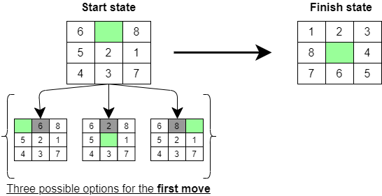

# puzzle_8


 
- [Installation](#anc1)
- [Usage](#anc2)
- [Contribution](#anc3)
- [How It Work](#anc4)
- [License](#anc5)

---
 Algorithmic solution of game "Puzzle 8" based on the methods of informed (blind) and informed (heuristic) searches with the possibility of parallelization. The analogue of this game is ["Puzzle 15"](https://en.wikipedia.org/wiki/15_puzzle). 

<a id="anc1"></a>

## Installation
- The sources for application can be downloaded from the [Github repo](https://github.com/rrtty0/puzzle_8.git).

* You can either clone the public repository:
```
        $ git clone https://github.com/rrtty0/puzzle_8.git 
```
<a id="anc2"></a>

## Usage

- To use this project you need to install [JDK 1.8](https://www.oracle.com/ru/java/technologies/javase/javase8-archive-downloads.html)

<a id="anc3"></a>

## Contribution
1. _Clone repo_ and _create a new branch_:
```
        $ git clone https://github.com/rrtty0/puzzle_8.git
        $ git branch name_for_new_branch
        $ git checkout name_for_new_branch
```
2. _Make changes_ and _test_
3. _Submit Pull Request_ with comprehensive description of changes

<a id="anc4"></a>

## How It Work

- The input is a state (numbers from 1 to 8 placed on the field 3x3 with one empty cell), which must be converted to the final state (predetermined) by moving the numbers through the cells, and in 1 move you can change the position of only one number from the neighboring an empty cell (cells on the left, right, top, bottom are considered neighbors). The task is to find such a sequence of changes in the positions of numbers in order to get from the initial state to the final state. For example:



* Possible algorithms for solving this problem:
   - [Blind DFS](https://en.wikipedia.org/wiki/Depth-first_search)
   - [Blind Parallel DFS](https://www.lrde.epita.fr/~bleton/doc/parallel-depth-first-search.pdf)
   - [Heuristic Manhattan searching](https://en.wikipedia.org/wiki/Taxicab_geometry)
   - [Heuristic parallel Manhattan searching](https://en.wikipedia.org/wiki/Taxicab_geometry)
   - [Heuristic A-Star searching](https://en.wikipedia.org/wiki/A*_search_algorithm)
   - [Heuristic parallel A-Star searching](https://en.wikipedia.org/wiki/A*_search_algorithm)

<a id="anc5"></a>

## License
Source Available License Agreement - [Apache License v2.0](./LICENSE).